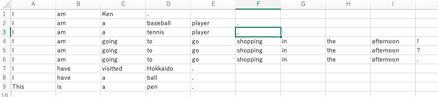
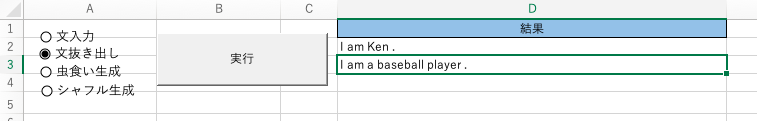

# English-Question-Maker

English-Question-Makerは英文の虫食い問題、シャッフル問題を生成をエクセル上で行うアプリケーションです。

使用言語：VBA

# アプリケーションを使う前に

エクセルファイルを開くとマクロの実行許可を求めるメッセージが上部に表示されるので、許可してください。

# エクセルファイルの構成
エクセルファイルには２つのシートがあります。
- mainシート：以下で説明する英文操作を行います
- dataシート：操作する英文が記されています。1行に１つの英文が、各セルに１つの単語が入っています。

# 英文操作
本アプリケーションで実行できるのは以下の４つです。

- 文入力：dataファイルに英文を登録します。
- 文抜き出し：選択した英文を出力します。
- 虫食い生成：選択した英文から１単語抜いた文を出力します。
- シャッフル生成：選択した英文を単語を並び替え、出力します。

## 文入力
入力前は以下のとおりです。

mainシートのラジオボタンで「文入力」を選択後、実行ボタンを押下することで入力フォームが出現します。

入力フォームには英文を入力します。文の終わりを示す「.」「?」の前には半角スペースを入力することを推奨します。

入力フォームのOKボタンを押すことでdataシートが更新されます。

更新後は以下のとおりです。

## 文抜き出し

mainシートのラジオボタンで「文抜き出し」を選択後、実行ボタンを押下することで入力フォームが出現します。

入力フォームには抜き出したい英文の行番号を「,」区切りで入力します。

今回は行番号の1と2を選択します。

入力フォームのOKボタンを押すことでmainシートの「結果」の列に表示されます。

## 虫食い生成

mainシートのラジオボタンで「虫食い生成」を選択後、実行ボタンを押下することで入力フォームが出現します。

入力フォームには抜き出したい英文の行番号を「,」区切りで入力します。

今回は行番号の1と2を選択します。

続いて、選択した各文の表示されなくする単語を選択します。
今回は行番号1の文は2単語目を、行番号2の文は3単語目を選択します。

入力フォームのOKボタンを押すことでmainシートの「結果」の列に選択した虫食い文が表示されます。

## シャッフル生成

mainシートのラジオボタンで「シャッフル生成」を選択後、実行ボタンを押下することで入力フォームが出現します。

入力フォームには抜き出したい英文の行番号を「,」区切りで入力します。

今回は行番号の1と2を選択します。

入力フォームのOKボタンを押すことでmainシートの「結果」の列にシャッフルされた文が「/」区切りで表示されます。

この時、最後の文字にである「.」「?」は一番最後に固定されます。

